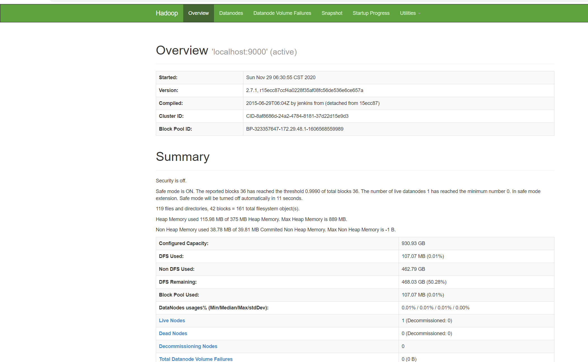
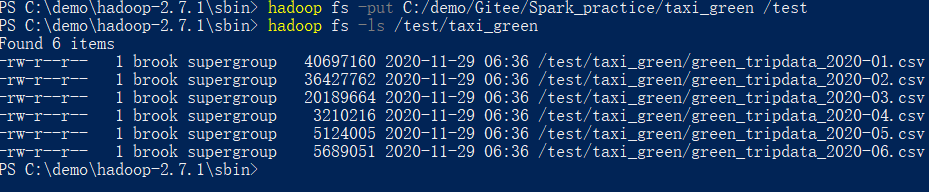
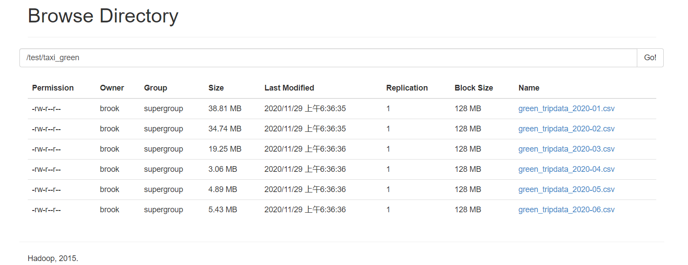
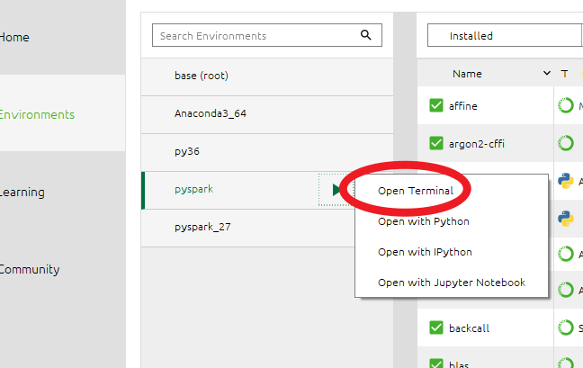
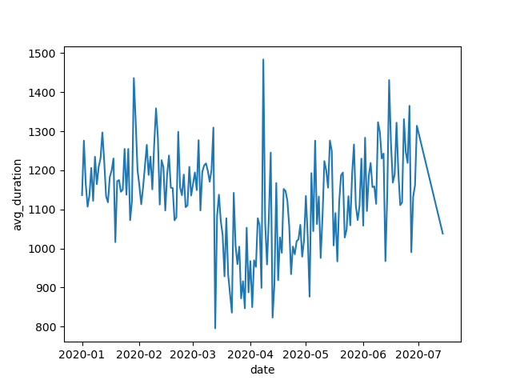
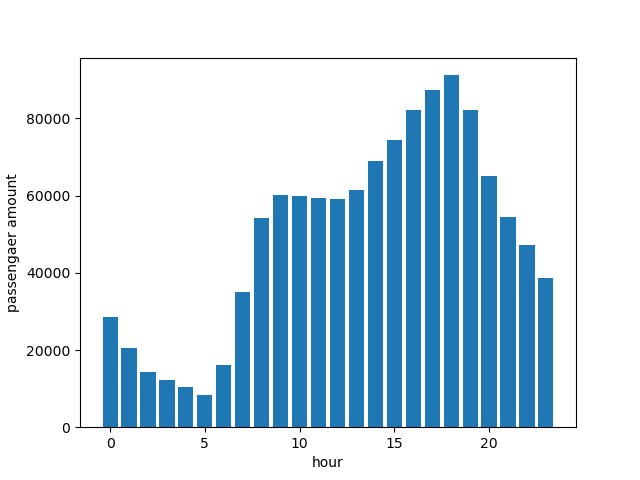
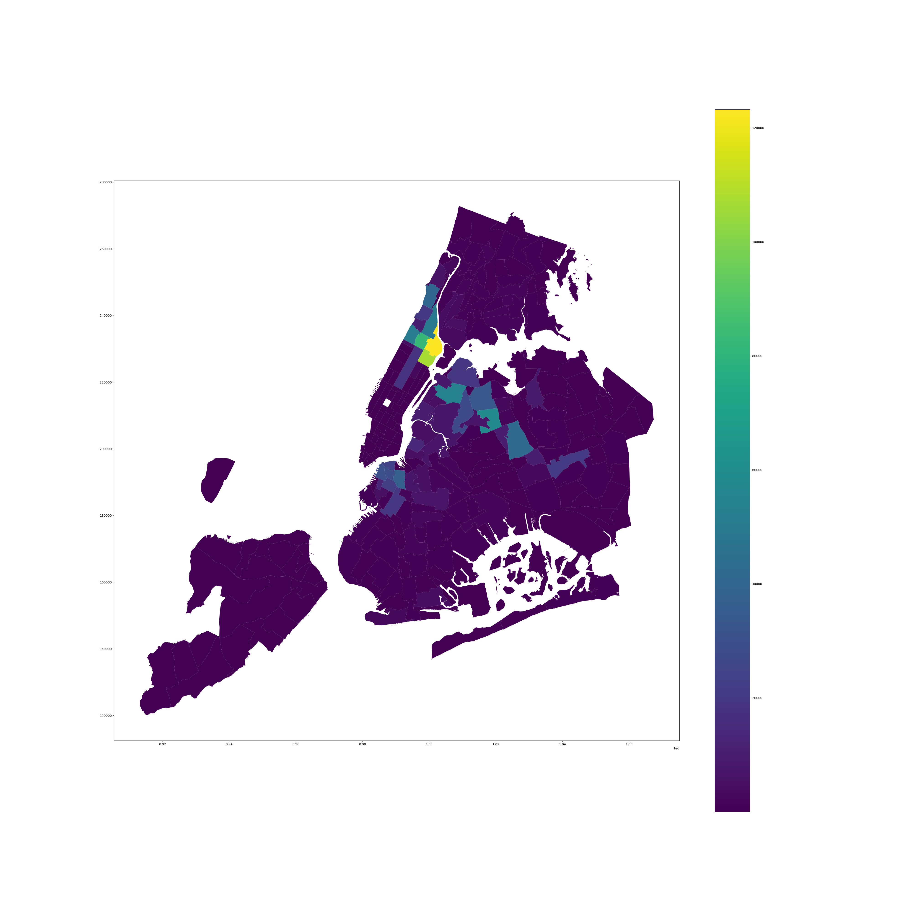
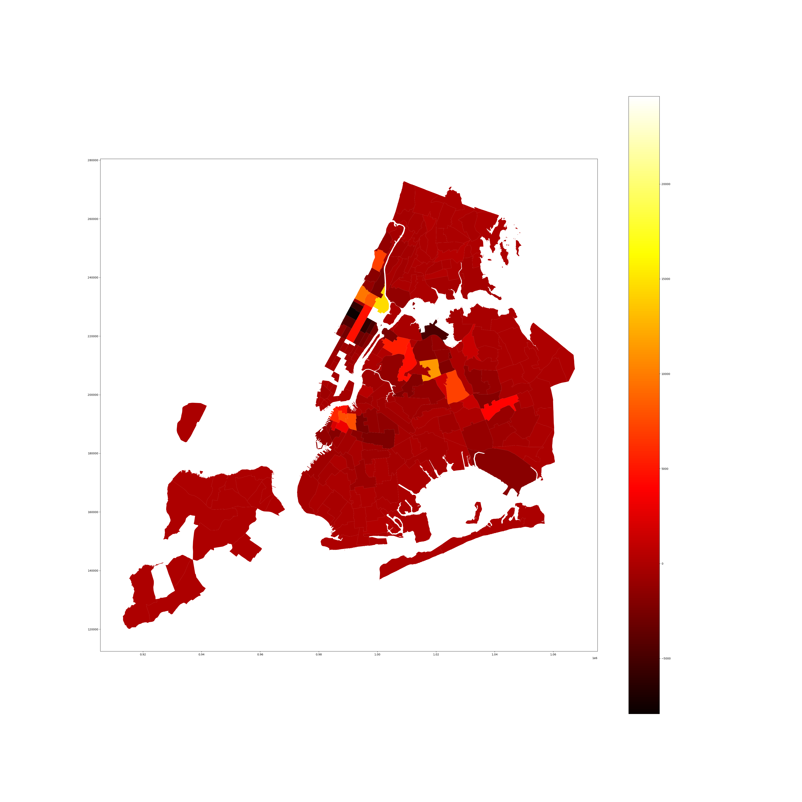
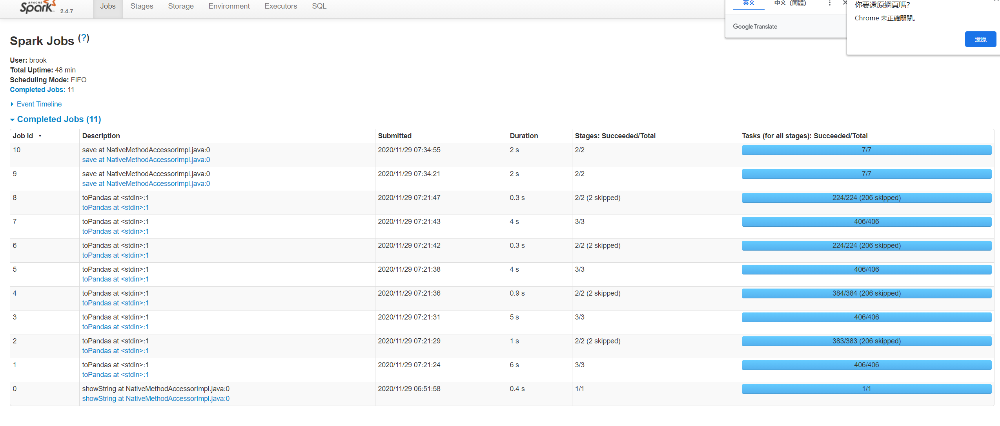
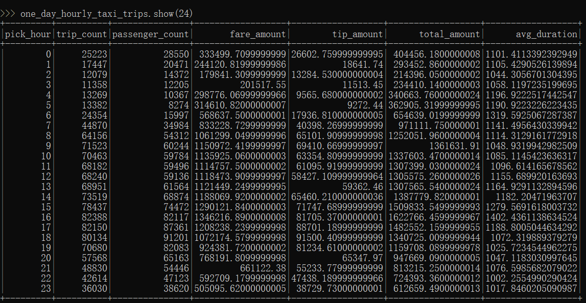

目录
=================

  * [数据集描述](#数据集描述)
    * [数据集名称：](#数据集名称)
    * [数据集内容：](#数据集内容)
    * [数据集选取](#数据集选取)
  * [分析目的](#分析目的)
  * [分析思路](#分析思路)
    * [1、covid\-19 影响](#1covid-19-影响)
    * [2、一天内“时间\-业务密度”分布情况](#2一天内时间-业务密度分布情况)
  * [注意：](#注意)
* [实验报告](#实验报告)
  * [一、搭建环境](#一搭建环境)
    * [1\.1 环境介绍](#11-环境介绍)
  * [二、实验步骤](#二实验步骤)
    * [2\.1 上传文件到hadoop](#21-上传文件到hadoop)
    * [2\.2 创建虚拟环境安装并运行pyspark](#22-创建虚拟环境安装并运行pyspark)
    * [2\.3 导入并处理数据](#23-导入并处理数据)
      * [将数据按照日期小时分类重整：](#将数据按照日期小时分类重整)
      * [按照日期分类重整，并且按照日期排序](#按照日期分类重整并且按照日期排序)
      * [画出乘客量随着日期的变化趋势：](#画出乘客量随着日期的变化趋势)
      * [画出一个小星期内的分布：（2020\-2\-3~2020\-2\-9）](#画出一个小星期内的分布2020-2-32020-2-9)
      * [画出旅程平均用时随日期变化趋势](#画出旅程平均用时随日期变化趋势)
      * [按照一天二十四小时对数据分类整合、排序：](#按照一天二十四小时对数据分类整合排序)
      * [画出一天之内乘客量分布：](#画出一天之内乘客量分布)
      * [画出一天之内乘车时间分布：](#画出一天之内乘车时间分布)
      * [分析地点分布：按照地址ID排序：](#分析地点分布按照地址id排序)
      * [看接人的地点分布：](#看接人的地点分布)
      * [看放人的地点分布：](#看放人的地点分布)
      * [接人的减去放人的：](#接人的减去放人的)
      * [看小费分布（pick）](#看小费分布pick)
      * [看小费分布（drop）](#看小费分布drop)
      * [google earth](#google-earth)
    * [2\.4 保存数据到hbase](#24-保存数据到hbase)


## 数据集描述

### 数据集名称：
['TLC Trip Records'](https://www1.nyc.gov/site/tlc/about/tlc-trip-record-data.page)
### 数据集内容：
该数据集为纽约市出租车载客情况，包含**用户上车时间、用户下车时间、用户上车下车区域（将纽约市分成264个小块并进行编码）、乘客人数、支付方式等**，一个月更新一次，现在更新到2020年6月。数据集格式为：**.csv**文件


| 数据域                | 描述                                                         |
| --------------------- | ------------------------------------------------------------ |
| VendorID              | 提供数据支持业务的公司：1= Creative Mobile Technologies, LLC; 2= VeriFone Inc. lpep |
| lpep_pickup_datetime  | 上车时间                                                     |
| lpep_dropoff_datetime | 下车时间                                                     |
| Passenger_count       | 乘客人数                                                     |
| Trip_distance         | 路程（单位为英里）                                           |
| PULocationID          | 乘客上车地区编号                                             |
| DOLocationID          | 乘客下车地区编号                                             |
| RateCodeID            | 电脑自动生成分类：1 =标准 2 =肯尼迪国际机场 3 =纽瓦克 4 =拿骚或威彻斯特 5 =谈判票价 6 =团体游 |
| Store_and_fwd_flag    | 该标志指示在将记录发送到供应商（也称为“存储转发”）之前，行程记录是否已保存在车辆内存中，因为车辆没有与服务器的连接。Y =存放和前进旅行N =不是存放和前进旅行 |
| Payment_type          | 表示旅客如何支付旅程的数字代码。 1 =信用卡2 =现金3 =不收费4 =争议5 =未知6 =无效旅行 |
| Fare_amount           | 计价器计算的时间和距离票价(每一米费用)。                     |
| Extra                 | 杂项附加费。 目前，这仅包括$ 0.50和$ 1高峰时间和隔夜费用。   |
| MTA_tax               | 根据使用的计量费率自动触发的$ 0.50 MTA税(纽约市政府收费项目，一般为0.5刀)。 |
| Improvement_surcharge | 改良附加费（纽约市政府收费项目，一般为0.3刀）                |
| Tip_amount            | 小费总额                                                     |
| Tolls_amount          | 旅途中支付的所有通行费总额（服务费和道路通行费等）。         |
| Total_amount          | 总收费，不包含现金小费                                       |
| Trip_type             | 用户出行类别，1=街边打车；2=软件调度                         |
### 数据集选取
该数据集有四种，yellow、green、FHV、HVF。分别表示不同机构的统计结果，这里由于大小限制选取**green**数据集。
时间选取为2019年1~6月和2020年1~6月，重点在于分析疫情对于该行业的影响。
## 分析目的
对比2019年和2020年第一季度的出租车业务变化情况，对其中各项指标进行分析，比如乘车总频次、乘车区域、乘车人数等指标进行分析，并分析同一天中用户业务集中时间段。
1. 同比对比2020年2019年纽约市出租车业务下滑情况，分析疫情对纽约市出租车业务影响
2. 分析四个行政区一天内出租车业务“时间-业务密度”分布情况的不同
## 分析思路
### 1、covid-19 影响
选取新闻上报道纽约市疫情最严重的几天并寻找2019年同几天的业务分布不同，分析计算纽约市四个行政区出租车业务下降比例的不同，并重点观察同车乘客人数变化。最后影射出四个行政区的行政管理方式、民众反应差别，以及出租车业务变化趋势。
### 2、一天内“时间-业务密度”分布情况
出租车业务不可能一天都是均匀分布的，会有早高峰、午高峰等等，通过画出“时间-业务密度”概率密度分布——CDPF图即可直观观察到出租车业务相对时间分布。
同时由于纽约市四个行政区贫富差距、居民生活水平以及生活方式都有不同情况，所以四个行政区的概率密度分布——CDPF图一定有所不同，通过分析同一季度下的分布不同，同样影射不同社区之间的社会差异。

## 注意：

2019年以后TLC就不再提供经纬度地址


# 实验报告

## 一、搭建环境

### 1.1 环境介绍

系统平台：Windows10 + ubuntu 20.04 LTS

java版本：jdk1.8.0_271

python版本：3.7.9

spark版本：2.4.7

pyspark版本：2.4.7

hadoop版本：2.7.1

hbase版本：1.4.13

## 二、实验步骤

### 2.1 上传文件到hadoop

第一步，安装并启动hadoop服务（win10）：

安装：（默认已安装java）

[下载](https://archive.apache.org/dist/hadoop/common/hadoop-2.7.1/)hadoop2.7.1并解压到C:\demo\hadoop-2.7.1

创建环境变量HADOOP_HOME


更改配置文件：

`hdfs-site.xml`

```xml
<configuration>
    <property>
        <name>dfs.replication</name>
        <value>1</value>
    </property>
    <property>
       <name>dfs.namenode.name.dir</name>
       <value>/distributed/hadoop/data/namenode</value>
    </property>
    <property>
       <name>dfs.datanode.data.dir</name>
       <value>/distributed/hadoop/data/datanode</value>
    </property>
	<property>
		<name>dfs.datanode.max.transfer.threads</name>
		<value>4096</value>
	</property>
</configuration>
```

`yarn-site.xml`

```xml
<configuration>
    <property>
        <name>dfs.replication</name>
        <value>1</value>
    </property>
    <property>
       <name>dfs.namenode.name.dir</name>
       <value>/distributed/hadoop/data/namenode</value>
    </property>
    <property>
       <name>dfs.datanode.data.dir</name>
       <value>/distributed/hadoop/data/datanode</value>
    </property>
	<property>
		<name>dfs.datanode.max.transfer.threads</name>
		<value>4096</value>
	</property>
</configuration>
```

所有的.cmd文件均更改编码格式


启动hadoop，（`C:\demo\hadoop-2.7.1\sbin` 目录下）运行：

```
PS C:\demo\hadoop-2.7.1\sbin> ./start-all
```

输入网址http://127.0.0.1:50070/来访问管理页面



点击‘utilities/browse the file system’来访问文件系统


使用命令：

```
hadoop fs -put C:/demo/Gitee/Spark_practice/taxi_green /test
```

将csv文件放入hadoop的/test 文件夹中



在webUI上也能查看



### 2.2 创建虚拟环境安装并运行pyspark

创建名为pyspark的虚拟环境，并在环境中安装pyspark2.4.7和geopandas

创建环境：

```bash
conda create -n pyspark python=3.7
```

运行虚拟环境：



安装pyspark：注意pyspark2只支持python3.7

```bash
pip install pyspark==2.4.7
```

安装geopandas：

由于安装依赖有问题，手动[下载](https://www.lfd.uci.edu/~gohlke/pythonlibs/#gdal)whl：

​	

```bash
pip install *.whl
pip install geopandas
```

在终端输入pyspark进入命令行页面


### 2.3 导入并处理数据

加载依赖包：

```python
from pyspark.sql import SparkSession
import pyspark.sql.functions as f
from pyspark.sql.types import *
import pandas as pd 
import geopandas as gpd
import contextily as ctx
#%matplotlib inline
import matplotlib.pyplot as plt
import matplotlib.patches as mpatches

from pandas.plotting import register_matplotlib_converters
register_matplotlib_converters()
```

创建spark session

```python
appName = "Python Example - PySpark Read CSV"
master = 'local'

# Create Spark session
spark = SparkSession.builder \
    .master(master) \
    .appName(appName) \
    .getOrCreate()
```

建立导入数据格式

```python
trip_schema = StructType([
    StructField('VendorID', StringType()),
    StructField('lpep_pickup_datetime', TimestampType()),
    StructField('lpep_dropoff_datetime', TimestampType()),
    StructField('store_and_fwd_flag', StringType()),
    StructField('RatecodeID', IntegerType()),
    StructField('PULocationID', IntegerType()),
    StructField('DOLocationID', IntegerType()),
    StructField('passenger_count', IntegerType()),
    StructField('trip_distance', DoubleType()),
    StructField('fare_amount', DoubleType()),
    StructField('extra', DoubleType()),

    StructField('mta_tax', DoubleType()),
    StructField('tip_amount', DoubleType()),
    StructField('tolls_amount', DoubleType()),
    StructField('ehail_fee', DoubleType()),
    StructField('improvement_surcharge', DoubleType()),
    StructField('total_amount', DoubleType()),
    StructField('payment_type', IntegerType()),
    StructField('trip_type', IntegerType()),
    StructField('congestion_surcharge', DoubleType()),
    ])

```

按照数据格式获取数据

```python
trip_data = spark.read \
    .option("header", True) \
    .schema(trip_schema) \
    .csv("hdfs://127.0.0.1:9000/test/taxi_green/*.csv")
trip_data.printSchema()
```

读取数据成功：


#### 将数据按照日期小时分类重整：

```python
extended_trips = trip_data \
    .withColumn("pick_date", f.to_date(trip_data["lpep_pickup_datetime"])) \
    .withColumn("pick_hour", f.hour(trip_data["lpep_pickup_datetime"]))\
    .withColumn("drop_date", f.to_date(trip_data["lpep_dropoff_datetime"])) \
    .withColumn("drop_hour", f.hour(trip_data["lpep_dropoff_datetime"])) \
    .withColumn("duration", f.unix_timestamp(trip_data["lpep_dropoff_datetime"]) - f.unix_timestamp(trip_data["lpep_pickup_datetime"]))
extended_trips = extended_trips.filter((trip_data["lpep_pickup_datetime"] > '2020-01-01 00:00:00'))

# 按照接上日期小时重整
hourly_taxi_trips = extended_trips \
    .groupBy("pick_date", "pick_hour").agg(
        f.count(extended_trips["fare_amount"]).alias("trip_count"),
        f.sum(extended_trips["passenger_count"]).alias("passenger_count"),
        f.sum(extended_trips["fare_amount"]).alias("fare_amount"),
        f.sum(extended_trips["tip_amount"]).alias("tip_amount"),
        f.sum(extended_trips["total_amount"]).alias("total_amount"),
        f.avg(extended_trips["duration"]).alias("avg_duration")
    )
#按照方向下日期小时重整
hourly_taxi_trips_drop = extended_trips \
    .groupBy("drop_date", "drop_hour").agg(
        f.count(extended_trips["fare_amount"]).alias("trip_count"),
        f.sum(extended_trips["passenger_count"]).alias("passenger_count"),
        f.sum(extended_trips["fare_amount"]).alias("fare_amount"),
        f.sum(extended_trips["tip_amount"]).alias("tip_amount"),
        f.sum(extended_trips["total_amount"]).alias("total_amount"),
        f.avg(extended_trips["duration"]).alias("avg_duration")
    )

```

#### 按照日期分类重整，并且按照日期排序

```python
daily_taxi_trips = hourly_taxi_trips.groupBy("pick_date").agg(
    f.sum(hourly_taxi_trips["trip_count"]).alias("trip_count"),
    f.sum(hourly_taxi_trips["passenger_count"]).alias("passenger_count"),
    f.sum(hourly_taxi_trips["fare_amount"]).alias("fare_amount"),
    f.sum(hourly_taxi_trips["tip_amount"]).alias("tip_amount"),
    f.sum(hourly_taxi_trips["total_amount"]).alias("total_amount"),
    f.avg(hourly_taxi_trips["avg_duration"]).alias("avg_duration")
)
daily_taxi_trips = daily_taxi_trips.sort("pick_date")
# daily_taxi_trips.write.mode("overwrite").parquet("./values/daily_taxi_trips")

daily_taxi_trips_drop = hourly_taxi_trips_drop.groupBy("drop_date").agg(
    f.sum(hourly_taxi_trips_drop["trip_count"]).alias("trip_count"),
    f.sum(hourly_taxi_trips_drop["passenger_count"]).alias("passenger_count"),
    f.sum(hourly_taxi_trips_drop["fare_amount"]).alias("fare_amount"),
    f.sum(hourly_taxi_trips_drop["tip_amount"]).alias("tip_amount"),
    f.sum(hourly_taxi_trips_drop["total_amount"]).alias("total_amount"),
    f.avg(hourly_taxi_trips_drop["avg_duration"]).alias("avg_duration")
)
daily_taxi_trips_drop = daily_taxi_trips_drop.sort("drop_date")
```

#### 画出乘客量随着日期的变化趋势：

```python
daily_taxi_trips_pandas = daily_taxi_trips.toPandas()
plt.figure(0)
plt.xlabel("date")
plt.ylabel("passengaer amount")
plt.plot(daily_taxi_trips_pandas["pick_date"],daily_taxi_trips_pandas["passenger_count"])
plt.savefig("./plot/distribution_six_month_pick.png")
```


#### 画出一个小星期内的分布：（2020-2-3~2020-2-9）

```python
one_week_data = daily_taxi_trips.filter((daily_taxi_trips["pick_date"] >= '2020-02-03') & (daily_taxi_trips["pick_date"] <= '2020-02-09'))
one_week_data_pandas = one_week_data.toPandas()
plt.cla()
plt.figure(10)
plt.xlabel("date")
plt.ylabel("passenger_count")
plt.plot(one_week_data_pandas["pick_date"],one_week_data_pandas["passenger_count"])
plt.savefig("./plot/one_week_passenger_count.png")
```


#### 画出旅程平均用时随日期变化趋势

```python
plt.cla()
plt.figure(0)
plt.xlabel("date")
plt.ylabel("avg_duration")
plt.plot(daily_taxi_trips_pandas["pick_date"],daily_taxi_trips_pandas["avg_duration"])
plt.savefig("./plot/avg_duration_six_month_pick.png")

```



#### 按照一天二十四小时对数据分类整合、排序：

```python
one_day_hourly_taxi_trips = hourly_taxi_trips.groupBy("pick_hour").agg(
    f.sum(hourly_taxi_trips["trip_count"]).alias("trip_count"),
    f.sum(hourly_taxi_trips["passenger_count"]).alias("passenger_count"),
    f.sum(hourly_taxi_trips["fare_amount"]).alias("fare_amount"),
    f.sum(hourly_taxi_trips["tip_amount"]).alias("tip_amount"),
    f.sum(hourly_taxi_trips["total_amount"]).alias("total_amount"),
    f.avg(hourly_taxi_trips["avg_duration"]).alias("avg_duration")
)
one_day_hourly_taxi_trips = one_day_hourly_taxi_trips.sort("pick_hour")
one_day_hourly_taxi_trips_pandas = one_day_hourly_taxi_trips.toPandas()
```

#### 画出一天之内乘客量分布：

```python
plt.cla()
plt.figure(1)
plt.xlabel("hour")
plt.ylabel("passengaer amount")
plt.bar(one_day_hourly_taxi_trips_pandas["pick_hour"],one_day_hourly_taxi_trips_pandas["passenger_count"])
plt.savefig("./plot/distribution_in_one_day_pick.png")
```



#### 画出一天之内乘车时间分布：

```python
plt.cla()
plt.figure(1)
plt.xlabel("hour")
plt.ylabel("avg_duration")
plt.bar(one_day_hourly_taxi_trips_pandas["pick_hour"],one_day_hourly_taxi_trips_pandas["avg_duration"])
plt.savefig("./plot/avg_duration_in_one_day_pick.png")
```


#### 分析地点分布：按照地址ID排序：

```python
# 按照接人的id排序
trip_data_group_by_PUL = extended_trips \
    .groupBy("PULocationID").agg(
        f.count(extended_trips["fare_amount"]).alias("trip_count"),
        f.sum(extended_trips["passenger_count"]).alias("passenger_count"),
        f.sum(extended_trips["fare_amount"]).alias("fare_amount"),
        f.sum(extended_trips["tip_amount"]).alias("tip_amount"),
        f.sum(extended_trips["total_amount"]).alias("total_amount"),
        f.avg(extended_trips["duration"]).alias("avg_duration")
    )

trip_data_group_by_PUL = trip_data_group_by_PUL.selectExpr("PULocationID as LocationID", "trip_count as trip_count", "passenger_count as passenger_count", "fare_amount as fare_amount", "tip_amount as tip_amount", "total_amount as total_amount")

# 按照放的ID排序
trip_data_group_by_DOL = extended_trips \
    .groupBy("DOLocationID").agg(
        f.count(extended_trips["fare_amount"]).alias("trip_count"),
        f.sum(extended_trips["passenger_count"]).alias("passenger_count"),
        f.sum(extended_trips["fare_amount"]).alias("fare_amount"),
        f.sum(extended_trips["tip_amount"]).alias("tip_amount"),
        f.sum(extended_trips["total_amount"]).alias("total_amount"),
        f.avg(extended_trips["duration"]).alias("avg_duration")
    )
trip_data_group_by_DOL = trip_data_group_by_DOL.selectExpr("DOLocationID as LocationID", "trip_count as trip_count", "passenger_count as passenger_count", "fare_amount as fare_amount", "tip_amount as tip_amount", "total_amount as total_amount")

```

#### 看接人的地点分布：

```python

world = gpd.read_file('./map/taxi_zones/taxi_zones.shp')
world_P = world.merge(trip_data_group_by_PUL.toPandas(), on = "LocationID", how = "outer")
world_D = world.merge(trip_data_group_by_DOL.toPandas(), on = "LocationID", how = "outer")

plt.figure(2)
fig, ax = plt.subplots(1, 1, figsize=(40,40))
world_P.plot(column= 'passenger_count', ax=ax, legend=True)
plt.savefig("./plot/map_passengaer_count_pick.png")
```



#### 看放人的地点分布：

```
plt.figure(3)
fig, ax = plt.subplots(1, 1, figsize=(40,40))
world_D.plot(column= 'passenger_count', ax=ax, legend=True)
plt.savefig("./plot/map_passengaer_count_drop.png")
```


#### 接人的减去放人的：

```python
trip_data_group_by_PUL = trip_data_group_by_PUL.selectExpr("LocationID as LocationID", "trip_count as Ptrip_count", "passenger_count as Ppassenger_count", "fare_amount as Pfare_amount", "tip_amount as Ptip_amount", "total_amount as Ptotal_amount")
trip_data_group_by_DOL = trip_data_group_by_DOL.selectExpr("LocationID as LocationID", "trip_count as Dtrip_count", "passenger_count as Dpassenger_count", "fare_amount as Dfare_amount", "tip_amount as Dtip_amount", "total_amount as Dtotal_amount")

trip_data_group_by_LOC_PminusD = trip_data_group_by_PUL.join(trip_data_group_by_DOL, on = 'LocationID', how="outer") 
trip_data_group_by_LOC_PminusD = trip_data_group_by_LOC_PminusD\
    .withColumn('Mtrip_count', trip_data_group_by_LOC_PminusD['Ptrip_count']-trip_data_group_by_LOC_PminusD['Dtrip_count'])\
    .withColumn('Mpassenger_count', trip_data_group_by_LOC_PminusD['Ppassenger_count']-trip_data_group_by_LOC_PminusD['Dpassenger_count'])\
    .withColumn('Mfare_amount', trip_data_group_by_LOC_PminusD['Pfare_amount']-trip_data_group_by_LOC_PminusD['Dfare_amount'])\
    .withColumn('Mtip_amount', trip_data_group_by_LOC_PminusD['Ptip_amount']-trip_data_group_by_LOC_PminusD['Dtip_amount'])\
    .withColumn('Mtotal_amount', trip_data_group_by_LOC_PminusD['Ptotal_amount']-trip_data_group_by_LOC_PminusD['Dtotal_amount'])

plt.figure(4)
fig, ax = plt.subplots(1, 1,figsize=(40,40))
world_PMD = world.merge(trip_data_group_by_LOC_PminusD.toPandas(), on = "LocationID", how = "outer")
world_PMD.plot(column= 'Mpassenger_count', ax=ax, legend=True, cmap='hot')
# world_PMD.plot(column= 'Mpassenger_count', ax=ax, legend=True, cmap='OrRd', scheme='quantiles')
plt.savefig("./plot/map_passengaer_count_pick_minus_drop.png")
```


| 上午6~9点：                                                  | 晚上3~6点                                                    |
| ------------------------------------------------------------ | ------------------------------------------------------------ |
|  |  |

#### 看小费分布（pick）

```python
plt.figure(20)
fig, ax = plt.subplots(1, 1, figsize=(40,40))
world_P.plot(column= 'tip_amount', ax=ax, legend=True)
plt.savefig("./plot/map_tip_amount_pick.png")
```


#### 看小费分布（drop）

```python
plt.figure(30)
fig, ax = plt.subplots(1, 1, figsize=(40,40))
world_D.plot(column= 'tip_amount', ax=ax, legend=True)
plt.savefig("./plot/map_tip_amount_drop.png")
```





#### google earth


### 2.4 保存数据到hbase

要保存的数据有：

trip_data_group_by_PUL

trip_data_group_by_DOL

trip_data_group_by_LOC_PminusD

daily_taxi_trips

one_day_hourly_taxi_trips

分别存为csv文件：



```python
trip_data_group_by_PUL.coalesce(1).write.format('com.databricks.spark.csv').options(header='true').save("C:/demo/pyspark_taxi/values/trip_data_group_by_PUL")
trip_data_group_by_DOL.coalesce(1).write.format('com.databricks.spark.csv').options(header='true').save("C:/demo/pyspark_taxi/values/trip_data_group_by_DOL")
trip_data_group_by_LOC_PminusD.coalesce(1).write.format('com.databricks.spark.csv').options(header='true').save("C:/demo/pyspark_taxi/values/trip_data_group_by_LOC_PminusD")
daily_taxi_trips.coalesce(1).write.format('com.databricks.spark.csv').options(header='true').save("C:/demo/pyspark_taxi/values/daily_taxi_trips")
one_day_hourly_taxi_trips.coalesce(1).write.format('com.databricks.spark.csv').options(header='true').save("C:/demo/pyspark_taxi/values/one_day_hourly_taxi_trips")
```

将这些文件存入ubuntu系统的hdfs中


再从hdfs中导入hbase中

首先新建容器'taxi',在/home/brook1711/hbase-1.4.13/bin目录下

```shell
./hbase shell
```

打开hbase shell

利用create命令新建表

```shell
create 'daily_taxi_trips','cf'
create 'one_day_hourly_taxi_trips','cf'
create 'trip_data_group_by_DOL','cf'
create 'trip_data_group_by_LOC_PminusD','cf'
create 'trip_data_group_by_PUL','cf'
```


```bash
./hbase org.apache.hadoop.hbase.mapreduce.ImportTsv -Dimporttsv.separator=, -Dimporttsv.columns="HBASE_ROW_KEY,cf:trip_count,cf:passenger_count,cf:fare_amount,cf:tip_amount,cf:total_amount,cf:avg_duration" daily_taxi_trips /result/daily_taxi_trips.csv
```

scan 'daily_taxi_trips'


```bash
./hbase org.apache.hadoop.hbase.mapreduce.ImportTsv -Dimporttsv.separator=, -Dimporttsv.columns="HBASE_ROW_KEY,cf:trip_count,cf:passenger_count,cf:fare_amount,cf:tip_amount,cf:total_amount,cf:avg_duration" one_day_hourly_taxi_trips /result/one_day_hourly_taxi_trips.csv
```

scan 'one_day_hourly_taxi_trips'


```bash
./hbase org.apache.hadoop.hbase.mapreduce.ImportTsv -Dimporttsv.separator=, -Dimporttsv.columns="HBASE_ROW_KEY,cf:Ptrip_count,cf:Ppassenger_count,cf:Pfare_amount,cf:Ptip_amount,cf:Ptotal_amount,cf:Dtrip_count,cf:Dpassenger_count,cf:Dfare_amount,cf:Dtip_amount,cf:Dtotal_amount,cf:Mtrip_count,cf:Mpassenger_count,cf:Mfare_amount,cf:Mtip_amount,cf:Mtotal_amount" trip_data_group_by_LOC_PminusD /result/trip_data_group_by_LOC_PminusD.csv
```

scan 'trip_data_group_by_LOC_PminusD'

