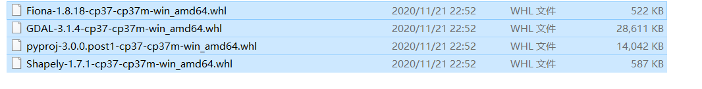

# 实验报告

## 一、搭建环境

### 1.1 环境介绍

系统平台：Windows10 + ubuntu 20.04 LTS

java版本：jdk1.8.0_271

python版本：3.7.9

spark版本：2.4.7

pyspark版本：2.4.7

hadoop版本：2.7.1

hbase版本：1.4.13

## 二、实验步骤

### 2.1 上传文件到hadoop

第一步，安装并启动hadoop服务（win10）：

安装：（默认已安装java）

[下载](https://archive.apache.org/dist/hadoop/common/hadoop-2.7.1/)hadoop2.7.1并解压到C:\demo\hadoop-2.7.1

创建环境变量HADOOP_HOME


更改配置文件：

`hdfs-site.xml`

```xml
<configuration>
    <property>
        <name>dfs.replication</name>
        <value>1</value>
    </property>
    <property>
       <name>dfs.namenode.name.dir</name>
       <value>/distributed/hadoop/data/namenode</value>
    </property>
    <property>
       <name>dfs.datanode.data.dir</name>
       <value>/distributed/hadoop/data/datanode</value>
    </property>
	<property>
		<name>dfs.datanode.max.transfer.threads</name>
		<value>4096</value>
	</property>
</configuration>
```

`yarn-site.xml`

```xml
<configuration>
    <property>
        <name>dfs.replication</name>
        <value>1</value>
    </property>
    <property>
       <name>dfs.namenode.name.dir</name>
       <value>/distributed/hadoop/data/namenode</value>
    </property>
    <property>
       <name>dfs.datanode.data.dir</name>
       <value>/distributed/hadoop/data/datanode</value>
    </property>
	<property>
		<name>dfs.datanode.max.transfer.threads</name>
		<value>4096</value>
	</property>
</configuration>
```

所有的.cmd文件均更改编码格式


启动hadoop，（`C:\demo\hadoop-2.7.1\sbin` 目录下）运行：

```
PS C:\demo\hadoop-2.7.1\sbin> ./start-all
```

输入网址http://127.0.0.1:50070/来访问管理页面


点击‘utilities/browse the file system’来访问文件系统


使用命令：

```
hadoop fs -put C:/demo/Gitee/Spark_practice/taxi_green /test
```

将csv文件放入hadoop的/test 文件夹中


在webUI上也能查看


### 2.2 创建虚拟环境安装并运行pyspark

创建名为pyspark的虚拟环境，并在环境中安装pyspark2.4.7和geopandas

创建环境：

```bash
conda create -n pyspark python=3.7
```

运行虚拟环境：


安装pyspark：注意pyspark2只支持python3.7

```bash
pip install pyspark==2.4.7
```

安装geopandas：

由于安装依赖有问题，手动[下载](https://www.lfd.uci.edu/~gohlke/pythonlibs/#gdal)whl：

​	

```bash
pip install *.whl
pip install geopandas
```

在终端输入pyspark进入命令行页面


### 2.3 导入并处理数据

加载依赖包：

```python
from pyspark.sql import SparkSession
import pyspark.sql.functions as f
from pyspark.sql.types import *
import pandas as pd 
import geopandas as gpd
import contextily as ctx
#%matplotlib inline
import matplotlib.pyplot as plt
import matplotlib.patches as mpatches

from pandas.plotting import register_matplotlib_converters
register_matplotlib_converters()
```

创建spark session

```python
appName = "Python Example - PySpark Read CSV"
master = 'local'

# Create Spark session
spark = SparkSession.builder \
    .master(master) \
    .appName(appName) \
    .getOrCreate()
```

建立导入数据格式

```python
trip_schema = StructType([
    StructField('VendorID', StringType()),
    StructField('lpep_pickup_datetime', TimestampType()),
    StructField('lpep_dropoff_datetime', TimestampType()),
    StructField('store_and_fwd_flag', StringType()),
    StructField('RatecodeID', IntegerType()),
    StructField('PULocationID', IntegerType()),
    StructField('DOLocationID', IntegerType()),
    StructField('passenger_count', IntegerType()),
    StructField('trip_distance', DoubleType()),
    StructField('fare_amount', DoubleType()),
    StructField('extra', DoubleType()),

    StructField('mta_tax', DoubleType()),
    StructField('tip_amount', DoubleType()),
    StructField('tolls_amount', DoubleType()),
    StructField('ehail_fee', DoubleType()),
    StructField('improvement_surcharge', DoubleType()),
    StructField('total_amount', DoubleType()),
    StructField('payment_type', IntegerType()),
    StructField('trip_type', IntegerType()),
    StructField('congestion_surcharge', DoubleType()),
    ])

```

按照数据格式获取数据

```python
trip_data = spark.read \
    .option("header", True) \
    .schema(trip_schema) \
    .csv("hdfs://127.0.0.1:9000/test/taxi_green/*.csv")
trip_data.printSchema()
```

读取数据成功：


将数据按照日期小时分类重整：

```python
extended_trips = trip_data \
    .withColumn("pick_date", f.to_date(trip_data["lpep_pickup_datetime"])) \
    .withColumn("pick_hour", f.hour(trip_data["lpep_pickup_datetime"]))\
    .withColumn("drop_date", f.to_date(trip_data["lpep_dropoff_datetime"])) \
    .withColumn("drop_hour", f.hour(trip_data["lpep_dropoff_datetime"])) \
    .withColumn("duration", f.unix_timestamp(trip_data["lpep_dropoff_datetime"]) - f.unix_timestamp(trip_data["lpep_pickup_datetime"]))
extended_trips = extended_trips.filter((trip_data["lpep_pickup_datetime"] > '2020-01-01 00:00:00'))

# 按照接上日期小时重整
hourly_taxi_trips = extended_trips \
    .groupBy("pick_date", "pick_hour").agg(
        f.count(extended_trips["fare_amount"]).alias("trip_count"),
        f.sum(extended_trips["passenger_count"]).alias("passenger_count"),
        f.sum(extended_trips["fare_amount"]).alias("fare_amount"),
        f.sum(extended_trips["tip_amount"]).alias("tip_amount"),
        f.sum(extended_trips["total_amount"]).alias("total_amount"),
        f.avg(extended_trips["duration"]).alias("avg_duration")
    )
#按照方向下日期小时重整
hourly_taxi_trips_drop = extended_trips \
    .groupBy("drop_date", "drop_hour").agg(
        f.count(extended_trips["fare_amount"]).alias("trip_count"),
        f.sum(extended_trips["passenger_count"]).alias("passenger_count"),
        f.sum(extended_trips["fare_amount"]).alias("fare_amount"),
        f.sum(extended_trips["tip_amount"]).alias("tip_amount"),
        f.sum(extended_trips["total_amount"]).alias("total_amount"),
        f.avg(extended_trips["duration"]).alias("avg_duration")
    )

```

按照日期分类重整，并且按照日期排序

```python
daily_taxi_trips = hourly_taxi_trips.groupBy("pick_date").agg(
    f.sum(hourly_taxi_trips["trip_count"]).alias("trip_count"),
    f.sum(hourly_taxi_trips["passenger_count"]).alias("passenger_count"),
    f.sum(hourly_taxi_trips["fare_amount"]).alias("fare_amount"),
    f.sum(hourly_taxi_trips["tip_amount"]).alias("tip_amount"),
    f.sum(hourly_taxi_trips["total_amount"]).alias("total_amount"),
    f.avg(hourly_taxi_trips["avg_duration"]).alias("avg_duration")
)
daily_taxi_trips = daily_taxi_trips.sort("pick_date")
# daily_taxi_trips.write.mode("overwrite").parquet("./values/daily_taxi_trips")

daily_taxi_trips_drop = hourly_taxi_trips_drop.groupBy("drop_date").agg(
    f.sum(hourly_taxi_trips_drop["trip_count"]).alias("trip_count"),
    f.sum(hourly_taxi_trips_drop["passenger_count"]).alias("passenger_count"),
    f.sum(hourly_taxi_trips_drop["fare_amount"]).alias("fare_amount"),
    f.sum(hourly_taxi_trips_drop["tip_amount"]).alias("tip_amount"),
    f.sum(hourly_taxi_trips_drop["total_amount"]).alias("total_amount"),
    f.avg(hourly_taxi_trips_drop["avg_duration"]).alias("avg_duration")
)
daily_taxi_trips_drop = daily_taxi_trips_drop.sort("drop_date")
```

画出乘客量随着日期的变化趋势：

```python
daily_taxi_trips_pandas = daily_taxi_trips.toPandas()
plt.figure(0)
plt.xlabel("date")
plt.ylabel("passengaer amount")
plt.plot(daily_taxi_trips_pandas["pick_date"],daily_taxi_trips_pandas["passenger_count"])
plt.savefig("./plot/distribution_six_month_pick.png")
```


画出旅程平均用时随日期变化趋势

```python
plt.cla()
plt.figure(0)
plt.xlabel("date")
plt.ylabel("avg_duration")
plt.plot(daily_taxi_trips_pandas["pick_date"],daily_taxi_trips_pandas["avg_duration"])
plt.savefig("./plot/avg_duration_six_month_pick.png")

```


按照一天二十四小时对数据分类整合、排序：

```python
one_day_hourly_taxi_trips = hourly_taxi_trips.groupBy("pick_hour").agg(
    f.sum(hourly_taxi_trips["trip_count"]).alias("trip_count"),
    f.sum(hourly_taxi_trips["passenger_count"]).alias("passenger_count"),
    f.sum(hourly_taxi_trips["fare_amount"]).alias("fare_amount"),
    f.sum(hourly_taxi_trips["tip_amount"]).alias("tip_amount"),
    f.sum(hourly_taxi_trips["total_amount"]).alias("total_amount"),
    f.avg(hourly_taxi_trips["avg_duration"]).alias("avg_duration")
)
one_day_hourly_taxi_trips = one_day_hourly_taxi_trips.sort("pick_hour")
one_day_hourly_taxi_trips_pandas = one_day_hourly_taxi_trips.toPandas()
```

画出一天之内乘客量分布：

```python
plt.cla()
plt.figure(1)
plt.xlabel("hour")
plt.ylabel("passengaer amount")
plt.bar(one_day_hourly_taxi_trips_pandas["pick_hour"],one_day_hourly_taxi_trips_pandas["passenger_count"])
plt.savefig("./plot/distribution_in_one_day_pick.png")
```


画出一天之内乘车时间分布：

```python
plt.cla()
plt.figure(1)
plt.xlabel("hour")
plt.ylabel("avg_duration")
plt.bar(one_day_hourly_taxi_trips_pandas["pick_hour"],one_day_hourly_taxi_trips_pandas["avg_duration"])
plt.savefig("./plot/avg_duration_in_one_day_pick.png")
```


分析地点分布：按照地址ID排序：

```python
# 按照接人的id排序
trip_data_group_by_PUL = extended_trips \
    .groupBy("PULocationID").agg(
        f.count(extended_trips["fare_amount"]).alias("trip_count"),
        f.sum(extended_trips["passenger_count"]).alias("passenger_count"),
        f.sum(extended_trips["fare_amount"]).alias("fare_amount"),
        f.sum(extended_trips["tip_amount"]).alias("tip_amount"),
        f.sum(extended_trips["total_amount"]).alias("total_amount"),
        f.avg(extended_trips["duration"]).alias("avg_duration")
    )

trip_data_group_by_PUL = trip_data_group_by_PUL.selectExpr("PULocationID as LocationID", "trip_count as trip_count", "passenger_count as passenger_count", "fare_amount as fare_amount", "tip_amount as tip_amount", "total_amount as total_amount")

# 按照放的ID排序
trip_data_group_by_DOL = extended_trips \
    .groupBy("DOLocationID").agg(
        f.count(extended_trips["fare_amount"]).alias("trip_count"),
        f.sum(extended_trips["passenger_count"]).alias("passenger_count"),
        f.sum(extended_trips["fare_amount"]).alias("fare_amount"),
        f.sum(extended_trips["tip_amount"]).alias("tip_amount"),
        f.sum(extended_trips["total_amount"]).alias("total_amount"),
        f.avg(extended_trips["duration"]).alias("avg_duration")
    )
trip_data_group_by_DOL = trip_data_group_by_DOL.selectExpr("DOLocationID as LocationID", "trip_count as trip_count", "passenger_count as passenger_count", "fare_amount as fare_amount", "tip_amount as tip_amount", "total_amount as total_amount")

```

看接人的地点分布：

```python

world = gpd.read_file('./map/taxi_zones/taxi_zones.shp')
world_P = world.merge(trip_data_group_by_PUL.toPandas(), on = "LocationID", how = "outer")
world_D = world.merge(trip_data_group_by_DOL.toPandas(), on = "LocationID", how = "outer")

plt.figure(2)
fig, ax = plt.subplots(1, 1, figsize=(40,40))
world_P.plot(column= 'passenger_count', ax=ax, legend=True)
plt.savefig("./plot/map_passengaer_count_pick.png")
```


看放人的地点分布：

```
plt.figure(3)
fig, ax = plt.subplots(1, 1, figsize=(40,40))
world_D.plot(column= 'passenger_count', ax=ax, legend=True)
plt.savefig("./plot/map_passengaer_count_drop.png")
```


接人的减去放人的：

```python
trip_data_group_by_PUL = trip_data_group_by_PUL.selectExpr("LocationID as LocationID", "trip_count as Ptrip_count", "passenger_count as Ppassenger_count", "fare_amount as Pfare_amount", "tip_amount as Ptip_amount", "total_amount as Ptotal_amount")
trip_data_group_by_DOL = trip_data_group_by_DOL.selectExpr("LocationID as LocationID", "trip_count as Dtrip_count", "passenger_count as Dpassenger_count", "fare_amount as Dfare_amount", "tip_amount as Dtip_amount", "total_amount as Dtotal_amount")

trip_data_group_by_LOC_PminusD = trip_data_group_by_PUL.join(trip_data_group_by_DOL, on = 'LocationID', how="outer") 
trip_data_group_by_LOC_PminusD = trip_data_group_by_LOC_PminusD\
    .withColumn('Mtrip_count', trip_data_group_by_LOC_PminusD['Ptrip_count']-trip_data_group_by_LOC_PminusD['Dtrip_count'])\
    .withColumn('Mpassenger_count', trip_data_group_by_LOC_PminusD['Ppassenger_count']-trip_data_group_by_LOC_PminusD['Dpassenger_count'])\
    .withColumn('Mfare_amount', trip_data_group_by_LOC_PminusD['Pfare_amount']-trip_data_group_by_LOC_PminusD['Dfare_amount'])\
    .withColumn('Mtip_amount', trip_data_group_by_LOC_PminusD['Ptip_amount']-trip_data_group_by_LOC_PminusD['Dtip_amount'])\
    .withColumn('Mtotal_amount', trip_data_group_by_LOC_PminusD['Ptotal_amount']-trip_data_group_by_LOC_PminusD['Dtotal_amount'])

plt.figure(4)
fig, ax = plt.subplots(1, 1,figsize=(40,40))
world_PMD = world.merge(trip_data_group_by_LOC_PminusD.toPandas(), on = "LocationID", how = "outer")
world_PMD.plot(column= 'Mpassenger_count', ax=ax, legend=True, cmap='hot')
# world_PMD.plot(column= 'Mpassenger_count', ax=ax, legend=True, cmap='OrRd', scheme='quantiles')
plt.savefig("./plot/map_passengaer_count_pick_minus_drop.png")
```


| 上午6~9点：                                                  | 晚上3~6点                                                    |
| ------------------------------------------------------------ | ------------------------------------------------------------ |
|  |  |


### 2.4 保存数据到hbase

要保存的数据有：

trip_data_group_by_PUL

trip_data_group_by_DOL

trip_data_group_by_LOC_PminusD

daily_taxi_trips

one_day_hourly_taxi_trips

分别存为csv文件：


```python
trip_data_group_by_PUL.coalesce(1).write.format('com.databricks.spark.csv').options(header='true').save("C:/demo/pyspark_taxi/values/trip_data_group_by_PUL")
trip_data_group_by_DOL.coalesce(1).write.format('com.databricks.spark.csv').options(header='true').save("C:/demo/pyspark_taxi/values/trip_data_group_by_DOL")
trip_data_group_by_LOC_PminusD.coalesce(1).write.format('com.databricks.spark.csv').options(header='true').save("C:/demo/pyspark_taxi/values/trip_data_group_by_LOC_PminusD")
daily_taxi_trips.coalesce(1).write.format('com.databricks.spark.csv').options(header='true').save("C:/demo/pyspark_taxi/values/daily_taxi_trips")
one_day_hourly_taxi_trips.coalesce(1).write.format('com.databricks.spark.csv').options(header='true').save("C:/demo/pyspark_taxi/values/one_day_hourly_taxi_trips")
```

将这些文件存入ubuntu系统的hdfs中

